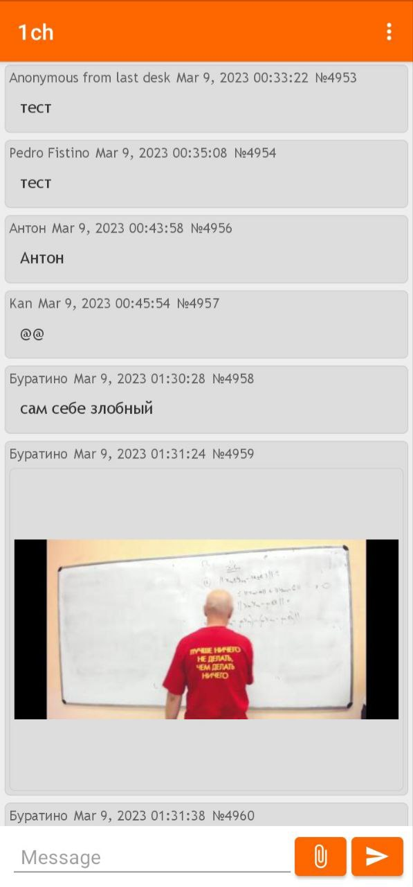

# Android мессенджер (1ch)

## Скрин из получившегося приложения



## Краткое описание

- Простой мессенджер с привычным интерфейсом (в этой версии есть только один канал, куда все пишут)
- Приложение кеширует на диск сообщения и картинки, без интернета можно посмотреть то, что было загружено ранее
- Некоторые применённые технологи:
  - корутины (работа с сетью, диском, MVVM)
  - Room (локальная бд сообщений)
  - Retrofit + Moshi (запросы к серверу + маппинг полученных ответов)
- Проект работает по принципам MVVM:
  - View -> ViewModel -> Model
  - Нижние слои дёргают методы верхних, а ответ получают асинхронно (используются корутины)
- У проекта есть (в этом репозитории их нет) две реализованные модификации:
  - Первая - без некоторых библиотек (потоки вместо корутин и HttpURLConnection вместо Retrofit)
  - Вторая - с различными каналами и с возможностью написать другим пользователям личное сообщение (но без кеширования)


## ТЗ

### Что надо

- Окно с сообщениями. В качестве примера посмотрите на чат в Telegram.
  - Все сообщения имеют
    - Отправителя <br/>
      Для ваших сообщений возьмите, например, ник на github
    - Получателя <br/> 
      На данный момент единственно возможное значение — `1@channel`. 
      Можно не отображать
    - Время отправки в UNIX Time в мс
    - Содержимое
      - Текст <br/> Просто показываем
      - Картинку <br/> Показываем, по клику подгружаем в нормальном разрешении
        в отдельную Activity
- Поле для ввода текста с кнопкой отправки.
- Ходить в сеть и управлять потоками через более-менее современные библиотеки
- При запуске показывать уже имеющиеся сообщения
- Отправка картинок
- При получении ошибки выводить локализованое [сообщение об ошибке](https://ru.wikipedia.org/wiki/%D0%A1%D0%BF%D0%B8%D1%81%D0%BE%D0%BA_%D0%BA%D0%BE%D0%B4%D0%BE%D0%B2_%D1%81%D0%BE%D1%81%D1%82%D0%BE%D1%8F%D0%BD%D0%B8%D1%8F_HTTP)
  - 5хх
  - 404
  - 409 (желательно обрабатывать автоматически)
  - 413
  - Остальные ошибки из диапазона 4хх не должны возникать в принципе

### Бонус

- +1 за возможность поделиться картинкой _из_ приложения
- +1 за возможность поделиться картинкой _в_ приложение
  - Открываем, например, Telegram, открываем картинку, тыкаем на загогулину
  - В меню снизу должна быть возможность выбрать ваше приложение

### Критерии провала

- Не работает с сетью
- Теряет данные при повороте (другой смене конфигурации)
- Падает
- Использует
  - Volley
  - `HttpURLConnection`
  - `org.json`
  - Gson
- Data race
- Утечка ресурсов
  - Внимательно следите за лямбдами
- `package com.example`
- Работа с сетью / диском 
  - На main потоке
  - Для корутин не на `Dispatchers.IO`
  - Для Rx не на `Schedulers.io()`
  - Аналогично для других фреймворков


### Что предполагается использовать

- [Retrofit](https://square.github.io/retrofit/)
  - Совместно с адаптерами к инструментам многопоточности и к мапперу
- Инструмент для многопоточности
  - RxJava
    - RxKotlin является надстройкой над RxJava
  - kotlinx.coroutines
- Маппер JSON
  - Moshi
  - kotlinx.serialization
  - Jackson
- Room
  - Можно что-то другое, но не голый JDBC/SQLiteOpenHelper
- OkIO

### Штрафы

- Все warning, кроме
  - IntentService deprecation
  - Accessability issues
- Запрос более 100 и менее 20 сообщений за раз
- Автоматическое обновление чаще раза в секунду
  - Подгрузка сообщений не считается

## API

Хост лежит по адресу http://213.189.221.170:8008

Если прилёг, пишите сразу в телегу, подниму как только смогу.

### Запросы

- GET `/1ch` <br/>
  Список сообщений
  - `limit` <br/>
    Сколько сообщений отдавать, по умолчанию 20
  - `lastKnownId` <br/>
    Начиная с какого сообщения отдавать сообщения, по умолчанию 0
  - `reverse` <br/>
    Возвращает сообщения в обратном порядке (с `id` _меньше_, чем `lastKnownId`), по умолчанию `false`
- GET `/img/<path>` <br/>
  Картиночка по указанному пути в хорошем разрешении
- GET `/thumb/<path>` <br/>
  Картиночка по указанному пути в шакальном разрешении
- POST `/1ch` с сообщением в body и `Content-Type=application/json`
    - `200 OK` и `id` поста
    - Ошибку, смотри коды состояния HTTP
- POST `/1ch` с сообщением в body и `Content-Type=multipart/form-data`
    - `200 OK` и `id` поста
    - Ошибку, смотри коды состояния HTTP
    - Сообщение идёт с названием `msg`
    - Картинка идёт с названием `picture`
    - Используйте `@Multipart` из Retrofit

### Ответы

- 1хх обрабатываются библиотекой
- 2хх 
  - 200 ОК
- 3хх обрабатываются библиотекой
- 4хх
  - 400 всё очень плохо, сервер вас не понял
  - 404 не найдено
  - 409 картинка _уже_ есть, вероятно, надо переотправить с другим названием
  - 411 не указан Content-Length для картинки
  - 413 слишком большая картинка
  - 415 кривой Content-Type у всего сообщения
    - `multipart/form-data`
    - `allpication/json`
  - 422 неполадка с переданными данными (например, отсутствует Content-Type в multipart/form-data, кривой JSON, неполный запрос)
- 5хх
  - 500 сервер почему-то что-то не смог; проблема, скорее всего, не на вашей стороне.

### Сообщение

```json lines
{
  "id": "123", // optional for request
  "from": "my name", // mandatory
  "to": "1@ch", // optional for request, defaults to "1@channel"
  "data": {
    "Text": {
      "text": "my message" // mandatory
    },
    // OR (moreover, XOR)
    "Image": {
      "link": "path/to/pic.jpg" // optional for request
    }
  },
  "time": "1297490" // UNIX-time, optional for requests
}
```
